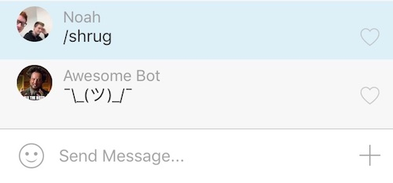

# GroupMe Bot Starter

[]()
[](https://david-dm.org/acmatuc/groupme-bot-starter)
[](https://david-dm.org/acmatuc/groupme-bot-starter?type=dev)

> Starter code for the GroupMe bot workshop at ACM@UC



## Before You Begin

You'll need a few things before you start:

* Git
    * Windows: install with [git-scm.com](https://git-scm.com/)
    * OS X: install with [git-scm.com](https://git-scm.com/) or [brew](http://brew.sh/)
    * Run `git --version` to verify that Git is installed
* Node.js >=4.0.0
    * Windows: install with [nodejs.org](https://nodejs.org/) or [nvm-windows](https://github.com/coreybutler/nvm-windows)
    * OS X: install with [nodejs.org](https://nodejs.org), [nvm](https://github.com/creationix/nvm), or [brew](http://brew.sh/)
    * Run `node --version` to see your Node.js version and verify that it is installed
* A [GroupMe](https://groupme.com/) account

## Quick Tour

```
├─┬ lib
│ ├── bot.js - handles bot logic
│ ├── dev.js - creates a proxy server (for local development)
│ └── server.js - handles GET and POST requests to the app
├── screenshots - various ui screenshots
├── .editorconfig
├── .env.example - a template for the `.env` file
├── .gitignore
├── app.js - the app entry point
├── LICENSE.txt
├── package.json - project info and dependencies
├── Procfile - deployment configuration (for Heroku and similar deployment platforms)
└── README.md
```

## Quick Start

### 0. Start a new GroupMe group

* Launch the GroupMe app (or use [web.groupme.com](https://web.groupme.com/)) and create a new group (or use an existing group)

### 1. Register a new GroupMe Bot

* Head over to [dev.groupme.com](https://dev.groupme.com/) and login with your GroupMe credentials
* [Go to the `bots` tab and select `Create Bot`](screenshots/dev.groupme.com.png)
* [Choose a group, and avatar uri for the bot. The callback url should be `http://localhost:3000` for now](screenshots/bot-create.jpg)
* Select `Submit` to create your bot
* [Select your bot from the list of bots and save the bot id for later](screenshots/bot-created.jpg)
* Check the group that you added the bot to. There should be a message in chat that your bot was added to the group
* Optional step: use the 'Test Your Bot' form (or use the provided `curl` command) on the newly created bot page to send a message to chat! This is an easy way to see how the bot interacts with GroupMe

### 2. Setup The Bot

Let's get this bot running on localhost!

* Verify Node.js is installed by running `node -v`
* Clone this repository with `git clone https://github.com/acmatuc/groupme-bot-starter.git`
* `cd groupme-bot-starter`
* Install dependencies with `npm install`
* Setup a `.env` for storing your GroupMe bot id
    * Copy `.env.example` to `.env` with `cp .env.example .env`
    * Put your bot id in the key field for the value `BOT_ID` and save

### 3. Starting The Server

* Making sure everything is setup correctly
    * Run `npm start` and head over to [`http://localhost:3000`](http://localhost:3000) in your favorite web browser. This is a `GET` request, so the app will respond with `Bot is responding to a GET request... hey there!`
    * This is great! The web server is working, but GroupMe sends `POST` requests to your app, so lets see if that is working
    * Use `^C` (`control` + `C`) to exit the program
* Responding to a GroupMe message
    * Run `npm start` (or `npm run dev` on development - see the note below)
    * Launch GroupMe and open the group that the bot is registered in
    * Post a message in the chat. By default the bot is setup to respond to messages starting with `/shrug`, so do that
    * You should see that the bot responds with `¯\_(ツ)_/¯`

#### Note: Running on your local machine

You'll notice that on your local development machine, you run `npm run dev` instead of `npm start`. In step 1 of this guide, you were told to set the bot url in GroupMe to `http://localhost:3000`. However, this setup will not work on your local development machine. The catch is that an external, api, such as GroupMe, cannot send a http request to `localhost`. The workaround: use a temporary proxy as a callback url while developing.

`npm run dev` will ask to expose port 3000 (your bot) to [localtunnel.me](http://localtunnel.me) - a very handy tool for web development. Localtunnel hands you a publicly accessible url that proxies to your local machine on a specified port. Don't like localtunnel? There are alternatives out there!

The localtunnel setup in this project will look at the `LT_SUBDOMAIN` environment variable to set a subdomain. If the environment variable is not set, localtunnel will choose a random subdomain. Use this domain as your GroupMe bot callback url. So if you were to set `LT_SUBDOMAIN="myawesomecallbackurl"` in your `.env`, then your GroupMe callback url would be `http://myawesomecallbackurl.localtunnel.me`

### 4. Customizing Your Bot

* Use `^C` to exit the program
* Open `lib/bot.js` in your favorite text editor and play around. Don't forget to run `npm start` or `npm run dev` after you make a change!

## Deploying to the Interwebz

Sure the bot works fine, but it is running on your local machine. Let's get the bot running on a live server for a 24/7 bot! Here are a few options to consider for deployment:

Note: be sure to set your `BOT_ID` in the `.env` (or equivalent configuration) and update the bot callback url in GroupMe to be that of your server for deployment!

### Deploying to Heroku

[Heroku](https://www.heroku.com/) is a nice option because of its PaaS 'push and forget' style of deployment. Heroku has a limited free tier that is great for deploying chat bots (the paid tier isn't too bad). Follow [these steps](https://devcenter.heroku.com/articles/getting-started-with-nodejs#introduction) to get your machine setup with Heroku and deploy your chat bot. Heroku even lets you easily set environment variables within their dashbaord or command line interface. This is super useful for setting a bot id configuration variable on Heroku.

### Deploying to dokku

[Dokku](http://dokku.viewdocs.io/dokku/) is another great option because its open source! Similar to Heroku, dokku allows you to 'push and forget', but the setup for dokku is more involved as it requires you to setup your own cloud server and install dokku before you can deploy. See [this guide](http://dokku.viewdocs.io/dokku/deployment/application-deployment/) for deploying to dokku. Like Heroku, dokku allows you to easily set environment variables like your bot id.

### Deploying to a cloud server

Heroku and dokku are great options for deployment of your chat bot, but you can simply spin up a small cloud server and run your chat bot with little setup. Some great, inexpensive cloud providers include [DigitalOcean](https://www.digitalocean.com/), [Amazon AWS](https://aws.amazon.com/), [Microsoft Azure](https://azure.microsoft.com/), [Linode](https://www.linode.com/), [Rackspace](https://www.rackspace.com/), and more! Setting up, deploying, and maintaining your app on your own cloud server is more involved than a Heroku or dokku setup, but it does allow for more customization.

After spinning up a linux box, you would:

1. Install [Node.js](https://nodejs.org/)
2. Install a process manager like [forever](https://github.com/foreverjs/forever) to run your chat bot in the background
3. `git clone` your chat bot to the server
4. Start the chat bot with the process manager

To update your bot:

1. Stop the chat bot with the process manager
2. `git pull` the latest chat bot changes
3. Start the chat bot with the process manager

## Beyond This Guide

Check out [dev.groupme.com](https://dev.groupme.com/) for more information on GroupMe's api. The possibilities are endless when it comes to chat bots. These bots interact with simple http requests, so you can build them in the language or platform of your choice.

## License

[GNU GPLv3 License](LICENSE.txt)

* Some content based on [groupme/bot-tutorial-nodejs](https://github.com/groupme/bot-tutorial-nodejs) (MIT License)


# Sample GroupMe NodeJS Callback Bot

## Introduction

This project shows the capability of a bot to react to messages sent within a group.

## Contents

  * [Quickly get our sample bot up and running in your groups](#deploy)
    * Deploy the code to heroku
    * Create a bot
    * Configure to your bot's credentials
  * [Make changes to the bot](#pull)
    * Pull the code down to your local machine
    * Configure the local environment variables to your bot's credentials

## Requirements:

  * GroupMe account
  * Heroku account
  * [Heroku Toolbelt](https://toolbelt.heroku.com/)

# Get your bot up and running<a name="deploy"></a>

## Deploy to Heroku:

Be sure to log into heroku, using your heroku credentials, then click the link below.

[](https://heroku.com/deploy)

You should be taken to a page that looks like this:


Optionally, you can give your app a name, or instead leave
it blank and let Heroku name it for you (you can change it later).


## Next, create a GroupMe Bot:

Go to:
https://dev.groupme.com/session/new

Use your GroupMe credentials to log into the developer site.


Once you have successfully logged in, go to https://dev.groupme.com/bots/new


Fill out the form to create your new bot:

  * Select the group where you want the bot to live
  * Give your bot a name
  * Paste in the url to your newly deply heroku app
    * `http://your-app-name-here.herokuapp.com/`
  * (Optional) Give your bot an avatar by providing a url to an image
  * Click submit

## Find your Bot ID:<a name="get-bot-id"></a>

Go here to view all of your bots:
https://dev.groupme.com/bots

Click on the one you just created.


On your Bot's page, copy the Bot ID


## Add your Bot ID to your Heroku app:

Go here to see all of your Heroku apps and select the one you just created before:

https://dashboard-next.heroku.com/apps


On your app page, click settings in the top navigation:


On your app's setting page, find the Config Vars section and click the Reveal Config Vars button:


Then click edit:


Fill out the form to add an environment variable to your app:

  * In the "key" field type: BOT_ID
  * In the "value" field paste your Bot ID that you copied in the previous steps
  * Click the save button


## Now go test your bot!

Go to GroupMe and type "/cool guy" in the group where your bot lives to see it in action.


# Make it your own<a name="pull"></a>

## Pull the code to your local machine

Within terminal, change directory to the location where you would like the files to live, then run this command:

    $ heroku git:clone -a YOUR_APP_NAME_HERE

And then change directory into the new folder

    $ cd YOUR_APP_NAME_HERE

## Configure your local BOT_ID environment variable

Open the file `.env` from your local files in your text editor of choice.
Find where it says "YOUR_BOT_ID_HERE" and replace it with the ID of your new bot.

If you don't know what your Bot ID is, please refer back to [this](#get-bot-id) section,
where it is explained how to retrieve it.

If your Bot ID is 12345678910, then:

    BOT_ID="YOUR_BOT_ID_HERE"

becomes:

    BOT_ID="12345678910"

## Start the server

To test your bot locally, open terminal and run the following command to start a local server.

    $ foreman start

Then navigate to `http://127.0.0.1:5000/` in a browser.


## All done! Go play around and make the bot your own.
